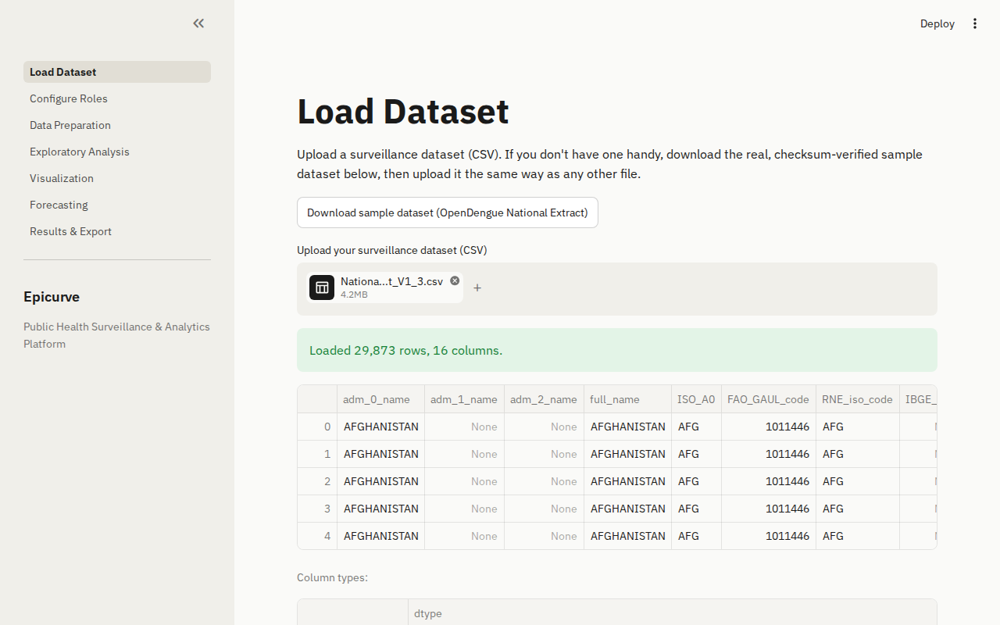
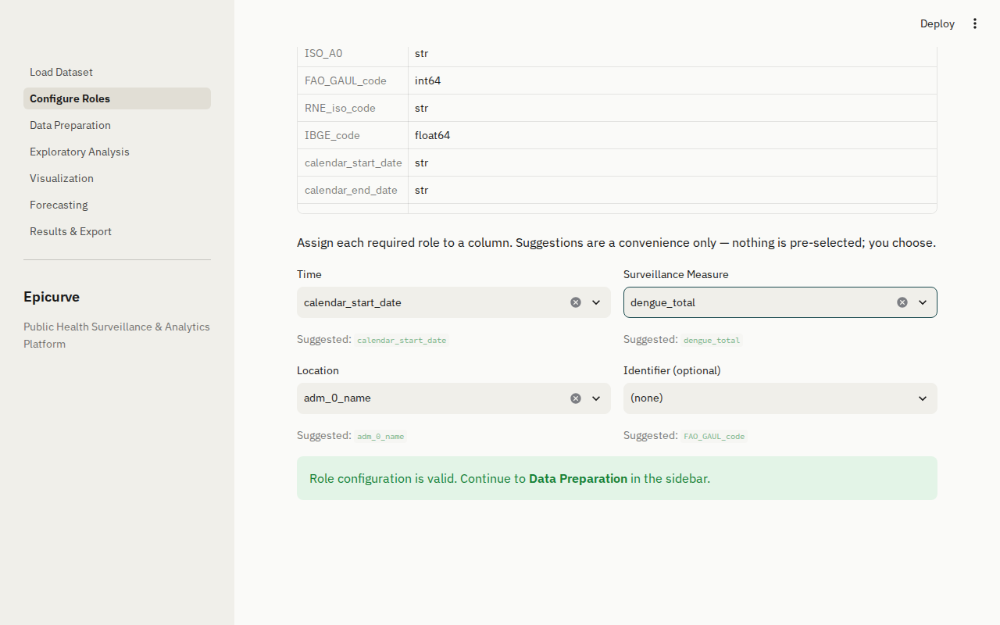
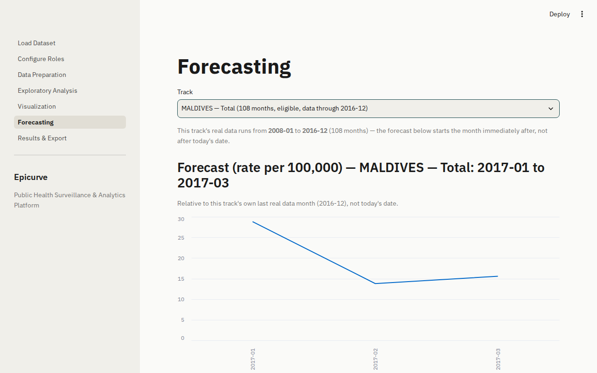

# Using the app

A quick walkthrough of what you'll actually see.

## 1. Load your data

Upload a CSV, or use the built-in sample dataset if you just want to try it out.

## 2. Tell it what your columns mean

Pick which column is the date, which is the location, and which holds your case counts. Nothing gets guessed automatically, you're always in control.

## 3. Let it clean and explore the data

The app checks the data for problems, cleans what it safely can, and shows you summary stats and charts.

## 4. Get a forecast, and know exactly what it means

Pick a location, and watch the model fit live. Every forecast tells you plainly what date range it's actually predicting, and why.

## 5. Export a report

A single HTML file with all your results, easy to share, and works fine on a phone.
